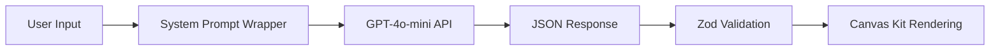

# NLUI Prompt Architecture Documentation

This directory contains the complete documentation of how NLUI Studio transforms user input into UI components using GPT-4o-mini.

## Quick Overview

When you type "Restaurant workers can swap shifts or bid on open shifts" into NLUI Studio, here's what happens behind the scenes:

1. **Your Input** → **System Prompt Wrapper** → **GPT-4o-mini** → **JSON Response** → **Canvas Kit UI**

## Files in This Directory

- **[SYSTEM_PROMPT.md](./SYSTEM_PROMPT.md)** - The complete system prompt that wraps all user inputs
- **README.md** (this file) - Comprehensive architecture documentation

## Architecture Deep Dive

### 1. Prompt Flow



### 2. API Configuration

The NLUI app is configured to use:

- **Model**: Configurable via `OPENAI_API_MODEL` (default: `gpt-4o-mini`)
- **Temperature**: `0.7` (balanced creativity and consistency)
- **Max Tokens**: `2000` (sufficient for complex UIs)
- **Response Format**: `json_object` (enforced JSON output)
- **Provider**: OpenAI or Azure OpenAI (configurable)

#### Supported Models

Any OpenAI model that supports chat completions can be used:

- **gpt-4o-mini** (default) - Fast, cost-effective, excellent for UI generation
- **gpt-4o** - Highest quality, best for complex layouts and sophisticated UIs
- **gpt-4-turbo** - Balanced performance, good for enterprise workflows
- **gpt-3.5-turbo** - Fastest and cheapest, suitable for simple UIs

To change models, update your `.env` file:
```env
OPENAI_API_MODEL=gpt-4o  # Use any supported model name
```

#### Model Performance Differences

Different models may produce varying results:

- **gpt-4o-mini**: Consistent, reliable UI generation with good component selection
- **gpt-4o**: More sophisticated layouts, better handling of complex business logic
- **gpt-3.5-turbo**: Simpler layouts, may miss nuanced UI patterns
- **gpt-4-turbo**: Good balance of sophistication and speed

#### Reasoning Models (o1-mini, o1-preview)

⚠️ **Important**: OpenAI's reasoning models require different API usage:
- They don't support system messages (our current prompt structure)
- They don't support `response_format: { type: 'json_object' }`
- They require a different request structure entirely

To use reasoning models would require modifying the `generateUI` function in `server/llm.ts` to:
1. Combine system prompt and user prompt into a single user message
2. Remove the `response_format` parameter
3. Handle the different response structure

This is not currently implemented but could be added as a feature.

### 3. Request Structure

Every request to the selected model follows this structure:

```javascript
{
  model: process.env.OPENAI_API_MODEL || "gpt-4o-mini",  // Configurable model
  messages: [
    {
      role: "system",
      content: SYSTEM_PROMPT  // The complete system prompt
    },
    {
      role: "user",
      content: "Restaurant workers can swap shifts or bid on open shifts"
    }
  ],
  response_format: { type: "json_object" },
  temperature: 0.7,
  max_tokens: 2000
}
```

### 4. Response Processing

1. **Raw Response**: The selected model returns JSON string
2. **Parsing**: `JSON.parse()` converts to JavaScript object
3. **Validation**: Zod schema validates structure and types
4. **Component Tree**: Validated JSON becomes component tree
5. **Rendering**: Canvas Kit components render the tree

### 5. Component Schema

The system prompt defines a strict schema that generates:

```typescript
interface UiResponse {
  version: "1.0";
  title: string;
  tree: UiNode;
}

interface UiNode {
  type: ComponentType;
  props?: Record<string, any>;
  children?: UiNode[];
}
```

### 6. Error Handling

The system handles various error scenarios:

- **Authentication**: Invalid API keys return 401 errors
- **Rate Limits**: 429 errors with retry guidance
- **Schema Validation**: Zod validation catches malformed responses
- **Empty Responses**: Fallback to error messages

## Key Features

### Workday-Centric Design

The prompt is specifically tuned for enterprise Workday applications:
- Employee management terminology
- Shift scheduling workflows
- Expense reporting interfaces
- Time tracking systems
- Benefits enrollment forms

### Canvas Kit Integration

All component props align with Workday's Canvas Kit design system:
- Button variants (`primary`, `secondary`)
- Field types (`text`, `select`, `date`, `combobox`)
- Status indicators with semantic colors
- Avatar sizes and variants
- Table structures with embedded components

### Intelligent Component Selection

The system intelligently chooses appropriate components:
- **Tables** for data display with sorting/filtering
- **Forms** for data entry workflows
- **Tabs** for organizing related content
- **Cards** for grouping information
- **Badges/Pills** for status indicators

## Real Examples

### Input: "Restaurant workers can swap shifts or bid on open shifts"

**System Processing:**
1. Identifies this as a shift management workflow
2. Recognizes need for multiple views (available shifts, swap requests)
3. Determines table format for shift listings
4. Adds action buttons for swapping/bidding
5. Includes status badges for shift states

**Generated Output:**
- Page with tab navigation
- Tables showing available shifts
- Swap request interface
- Status indicators for shift states
- Action buttons for user interactions

### Input: "Employee expense report dashboard"

**System Processing:**
1. Recognizes expense management context
2. Identifies need for data visualization
3. Determines card-based layout for reports
4. Adds status tracking for approvals
5. Includes filtering and search capabilities

**Generated Output:**
- Dashboard with expense cards
- Status badges (Submitted, Approved, Rejected)
- Filter controls and search
- Action buttons for report management

## Environment Variables

The prompt system can be configured via environment variables:

```bash
# OpenAI Configuration
OPENAI_API_KEY=your_openai_key
OPENAI_API_MODEL=gpt-4o-mini          # Model selection
OPENAI_API_BASE=https://api.openai.com/v1  # API endpoint
OPENAI_PROVIDER=openai                # Provider type

# Azure OpenAI Configuration (alternative)
OPENAI_PROVIDER=azure
AZURE_OPENAI_ENDPOINT=your_endpoint
AZURE_OPENAI_DEPLOYMENT=gpt-4o-mini
AZURE_OPENAI_API_KEY=your_azure_key
AZURE_OPENAI_API_VERSION=2024-02-15-preview
```

## Customization

### Modifying the System Prompt

To customize how NLUI generates UIs:

1. Edit `server/llm.ts` - line 4-40 contains the `SYSTEM_PROMPT`
2. Modify component types, props, or guidelines
3. Restart the server to apply changes
4. Test with various user inputs

### Adding New Component Types

To add new components:

1. Add the component type to the `UiNode` type definition
2. Define the component's prop structure in the guidelines
3. Update the Canvas Kit renderer (`src/runtime/canvasRenderer.tsx`)
4. Test with prompts that would use the new component

## Debugging

### Common Issues

1. **Schema Validation Errors**: Check Zod schema matches system prompt
2. **Component Rendering Errors**: Verify Canvas Kit component usage
3. **Empty Responses**: Check API key configuration and rate limits
4. **Unexpected Components**: Review prompt guidelines for component selection

### Logging

The server logs helpful information:
- Prompt processing: `console.log('Generating UI for prompt:', prompt)`
- Success confirmation: `console.log('Generated UI successfully')`
- Error details: `console.error('LLM Error:', error)`

## Security Considerations

The prompt system is designed to be safe:
- **No Code Generation**: Only generates JSON data structures
- **Sandboxed Output**: No executable code in responses
- **Validated Schema**: All outputs validated against strict schema
- **No External Calls**: Prompt doesn't make external API requests

## Performance

The current configuration balances quality and speed:
- **Response Time**: Typically 1-3 seconds per generation
- **Token Usage**: Average 200-800 tokens per request
- **Rate Limits**: Depends on OpenAI plan (usually 3500 RPM)
- **Caching**: No caching implemented (each request is fresh)

## Future Enhancements

Potential improvements to the prompt system:
- **Context Awareness**: Remember previous generations in session
- **Template Integration**: Use saved templates to guide generation
- **Multi-turn Conversations**: Iterative UI refinement
- **Component Library**: Expand supported Canvas Kit components
- **Accessibility**: Enhanced ARIA and accessibility guidelines

---

*This documentation provides a complete "peek behind the curtain" of how NLUI Studio transforms natural language into professional UI components.*